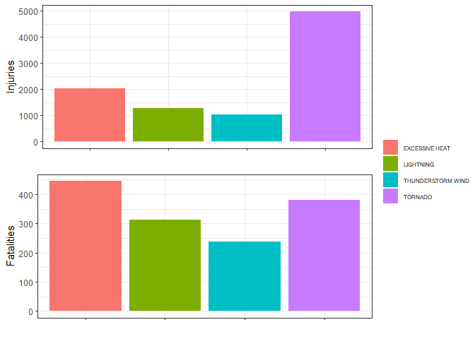
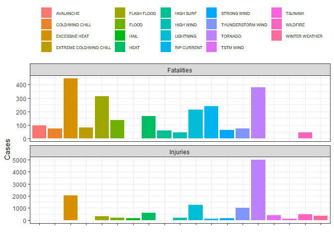

-------  

## Synopsis

This project involves exploring the U.S. National Oceanic and Atmospheric Administration's (NOAA) storm database. This database tracks characteristics of major storms and weather events in the United States, including when and where they occur, as well as estimates of any fatalities, injuries, and property damage.  

This analysis address the following questions:  

* Across the United States, which types of events are most harmful with respect to population health?  

* Across the United States, which types of events have the greatest economic consequences?  

More infomartion about the dataset can be found [here](https://d396qusza40orc.cloudfront.net/repdata%2Fpeer2_doc%2Fpd01016005curr.pdf) and [here](https://d396qusza40orc.cloudfront.net/repdata%2Fpeer2_doc%2FNCDC%20Storm%20Events-FAQ%20Page.pdf)

-------  

## Data Processing  
First, load the R libraries that will be used and set system locale to avoid conflits  


```r
library(ggplot2, warn.conflicts = F)
library(dplyr, quietly = T, warn.conflicts = F)
library(data.table, quietly = T, warn.conflicts = F)
library(ggpubr, quietly = T, warn.conflicts = F)
Sys.setlocale('LC_ALL','English')  
```

```
## [1] "LC_COLLATE=English_United States.1252;LC_CTYPE=English_United States.1252;LC_MONETARY=English_United States.1252;LC_NUMERIC=C;LC_TIME=English_United States.1252"
```

Now start by creating a directory to store data and figures, download the data from the web then load into R.  
Also, create a text file which states the url and time/timezone of download.  


```r
datadir <- './data'
figuredir <- './figures'
dataurl <- 'https://d396qusza40orc.cloudfront.net/repdata%2Fdata%2FStormData.csv.bz2'
datafilepath <- paste0(datadir,'/NOAAdata.csv.bz2')


if(!dir.exists(datadir)){
        dir.create(datadir)
}

if(!file.exists(datafilepath)){
        
        download.file(url = dataurl,destfile = datafilepath,method = 'curl')
        
        time <- as.character(Sys.time())
        timezone <- Sys.timezone()
        
        downloadinfo <- data.frame(list(time = time, 
                             format = "%Y-%m-%d %H:%M:%S",
                             timezone = timezone))
        
        write.table(x = downloadinfo,
                    file = paste0(datadir,'/downloadinfo.txt'),
                    row.names = F)
}

NOAAdata <- fread(file = datafilepath,data.table = F)

if(!dir.exists(figuredir)){
        dir.create(figuredir)
}
```

Some preprocessing will need to be done.

First, transform begin dates (**BGN_DATE**) from character to date format.


```r
NOAAdata <- NOAAdata %>% mutate(BGN_DATE = strptime(BGN_DATE, '%m/%d/%Y %H:%M:%S'))
```

Now it's a good time to filter the more recent events to work with and select the columns of interest. Here, filter data from 2005 to 2010 and select state, county code, event type, fatalities, injuries, property damages and crop damage. 


```r
NOAAdata0510 <- NOAAdata %>% 
        filter(between(BGN_DATE, '2005-01-01','2010-12-31')) %>% 
        select(BGN_DATE,STATE,COUNTY,EVTYPE,
               FATALITIES,INJURIES,PROPDMG,
               PROPDMGEXP,CROPDMG,CROPDMGEXP)
```

Now give proper class to all the variables that need it.  


```r
NOAAdata0510 <- NOAAdata0510 %>%
        mutate(STATE = as.factor(STATE), COUNTY = as.factor(COUNTY), EVTYPE = as.factor(EVTYPE))
```

To deal with property and crop damage properly, we need a function to turn their values into actual amount considering their units.


```r
actualamount <-function(cost, unit){
        if(unit == 'K'){
                return((cost*1e3))
        }else if(unit == 'M'){
                return(cost*1e6)
        }else if(unit == 'B'){
                return(cost*1e9)
        }else{
                return(cost)
        }
}
```

Now use this function to transform those values to proper use.  


```r
NOAAdata0510 <- NOAAdata0510 %>% 
        mutate(prop = mapply(actualamount, PROPDMG,PROPDMGEXP),
               crop = mapply(actualamount,CROPDMG,CROPDMGEXP))
```

---  

## Results

#### Across the United States, which types of events are most harmful with respect to population health?  

First, a general look at the United States at total injuries and fatalities for each type of event during the period from 2005 to 2010. A summary and bar plots are appropriate to see this.  


```r
health <- NOAAdata0510 %>% group_by(EVTYPE) %>%
        summarise(Injuries = sum(INJURIES), Fatalities = sum(FATALITIES) ) %>% 
        filter(Injuries > 100)  
```

```
## `summarise()` ungrouping output (override with `.groups` argument)
```

```r
summary(health)[,2:3]  
```

```
##     Injuries        Fatalities   
##  Min.   : 116.0   Min.   :  3.0  
##  1st Qu.: 153.0   1st Qu.: 34.0  
##  Median : 326.0   Median : 64.0  
##  Mean   : 746.9   Mean   :136.3  
##  3rd Qu.: 611.0   3rd Qu.:216.0  
##  Max.   :4974.0   Max.   :446.0  
## 
```

```r
plt1<- ggplot(health, aes(fill = EVTYPE,x = EVTYPE, y = Injuries)) + 
        geom_bar(stat='identity') +
        theme_bw() +
        scale_x_discrete(labels=NULL) + 
  theme(legend.text = element_text(size=6),legend.title = element_blank()) + 
  labs(x = '')

plt2 <- ggplot(health, aes(fill = EVTYPE,x = EVTYPE, y = Fatalities)) + 
        geom_bar(stat='identity') +
        theme_bw() +
        scale_x_discrete(labels=NULL)  + theme(legend.text = element_text(size=6),legend.title = element_blank()) + 
  labs(x = '')

ggarrange(plt1, plt2, common.legend = TRUE, legend = "bottom")
```

<!-- -->

It can be seen excessive heat and tornadoes are the ones to make more injuries and to have more fatalities. Some attention must be given to flash floods too, which are very deadly.  

Now, a look at what happened in each state during this time.  


```r
healthforstate <- NOAAdata0510 %>% group_by(EVTYPE,STATE) %>%
        summarise(Injuries = sum(INJURIES), Fatalities = sum(FATALITIES),
                  .groups = 'keep') %>% 
        filter(Injuries > 100)  

summary(healthforstate)[,3:4]  
```

```
##     Injuries        Fatalities   
##  Min.   : 101.0   Min.   : 0.00  
##  1st Qu.: 128.0   1st Qu.: 8.00  
##  Median : 189.0   Median :15.00  
##  Mean   : 268.7   Mean   :17.66  
##  3rd Qu.: 305.0   3rd Qu.:22.00  
##  Max.   :1593.0   Max.   :68.00  
## 
```

```r
plt3<-ggplot(healthforstate, aes(fill = EVTYPE,x = EVTYPE, y = Injuries)) + 
        geom_bar(stat='identity') +
        facet_wrap(. ~ STATE) +
        theme_bw() +
        scale_x_discrete(labels=NULL) + 
  theme(legend.text = element_text(size=6),legend.title = element_blank()) + 
  labs(x = '')


plt4<-ggplot(healthforstate, aes(fill = EVTYPE,x = EVTYPE, y = Fatalities)) + 
        geom_bar(stat='identity') +
        facet_wrap(. ~ STATE) +
        theme_bw() +
        scale_x_discrete(labels=NULL)  + 
  theme(legend.text = element_text(size=6),legend.title = element_blank()) + 
  labs(x = '')

ggarrange(plt3, plt4, common.legend = TRUE, legend = "bottom")
```

<!-- -->

Tornadoes seem to be a big problem for health in most states, but excessive heat hits Missouri very hard.  

#### Across the United States, which types of events have the greatest economic consequences?  

A general look at the United States at total damage amount for properties and crops for each type of event during the period from 2005 to 2010. A summary and bar plots are appropriate to see this.  


```r
dmg <- NOAAdata0510 %>% group_by(EVTYPE) %>%
        summarise(Properties = sum(prop), Crops = sum(crop) ) %>% 
        filter(Crops > 1e8)  
```

```
## `summarise()` ungrouping output (override with `.groups` argument)
```

```r
summary(dmg)[,2:3]  
```

```
##    Properties            Crops          
##  Min.   :3.260e+06   Min.   :1.604e+08  
##  1st Qu.:3.456e+08   1st Qu.:2.585e+08  
##  Median :2.457e+09   Median :4.924e+08  
##  Mean   :1.550e+10   Mean   :1.047e+09  
##  3rd Qu.:6.086e+09   3rd Qu.:1.070e+09  
##  Max.   :1.240e+11   Max.   :4.081e+09  
## 
```

```r
plt5<-ggplot(dmg, aes(fill = EVTYPE,x = EVTYPE, y = Properties)) + 
        geom_bar(stat='identity') +
        theme_bw() +
        scale_x_discrete(labels=NULL)+ theme(legend.text = element_text(size=6),legend.title = element_blank()) + 
  labs(x = '')


plt6<-ggplot(dmg, aes(fill = EVTYPE,x = EVTYPE, y = Crops)) + 
        geom_bar(stat='identity') +
        theme_bw() +
        scale_x_discrete(labels=NULL)+ theme(legend.text = element_text(size=6),legend.title = element_blank()) + 
  labs(x = '')

ggarrange(plt5, plt6, common.legend = TRUE, legend = "bottom")
```

<!-- -->

It can be seen floods and hurricanes are the ones to make more property and crop damage. Some attention must be given to drought too, which costs the highest to crops.  


